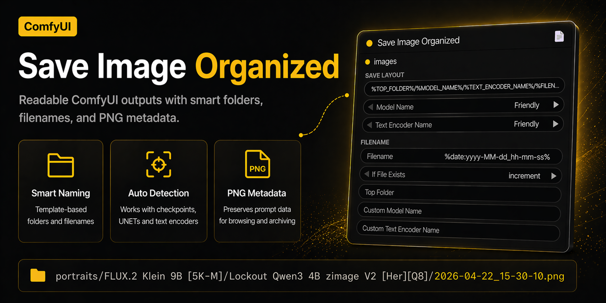

# ComfyUI Clean Save Nodes



ComfyUI Clean Save Nodes is a ComfyUI custom node pack for clean image saving, filename templates, model and text encoder naming, and PNG prompt metadata preservation.

It is built for ComfyUI workflows that need readable output folders, predictable filenames, and easier organization across checkpoints, UNETs, CLIPs, GGUF text encoders, and template-driven save paths.

## Why Use It

- cleaner `Save Image` behavior for ComfyUI outputs
- readable folder names for models and text encoders
- filename templates with `%date:...%`, `%strftime:...%`, and `%node.widget%`
- automatic model and text encoder detection from the active workflow
- preserved PNG prompt metadata for downstream browsing and archiving
- in-node help plus markdown docs for the ComfyUI `Info` tab

## Included Nodes

- `Save Image Clean`: a ComfyUI save image node with cleaner naming, template-based layouts, and metadata-preserving PNG output
- `Strip Model Extension`: a small utility node for removing `.safetensors`, `.gguf`, and other known model extensions

## Quick Start

1. Put the repository into `ComfyUI/custom_nodes/comfyui-clean-save-nodes`
2. Install the packages from `requirements.txt` in the Python environment used by ComfyUI
3. Restart ComfyUI
4. Add `Save Image Clean`

Documentation:

- [Installation](docs/INSTALLATION.md)
- [Usage](docs/USAGE.md)
- [Changelog](CHANGELOG.md)

## Best For

- ComfyUI users who want better output organization without rewriting their workflow
- FLUX, SDXL, checkpoint, UNET, CLIP, and GGUF-heavy setups with messy loader names
- workflows that save many test renders and need searchable folders and filenames
- users who want template-based output paths while keeping prompt metadata inside PNG files

## Save Image Clean

The node is built around four plain concepts:

- `Top Folder`
- `Model Name`
- `Text Encoder Name`
- `Filename`

Default save layout:

```text
%TOP_FOLDER%/%MODEL_NAME%/%TEXT_ENCODER_NAME%/%FILENAME%
```

Default filename:

```text
%date:yyyy-MM-dd_hh-mm-ss%
```

Example result:

```text
portraits/FLUX.2 Klein 9B [5K-M]/Lockout Qwen3 4B zimage V2 [Her][Q8]/2026-04-22_15-30-10.png
```

If `Top Folder` is empty, no extra folder is added.

### Model Name And Text Encoder

Both dropdowns use the same three choices:

- `Friendly`
- `Exact`
- `Custom`

Examples:

- `Friendly` model name: `FLUX.2 Klein 9B [5K-M]`
- `Exact` model name: `flux-2-klein-9b-Q5_K_M`
- `Friendly` text encoder: `Lockout Qwen3 4B zimage V2 [Her][Q8]`
- `Exact` text encoder: `Lockout-Qwen3-4b-zimage-hereticV2-q8`

Common descriptor words in `Friendly` names are shortened into bracket tags:

- `abliterated` -> `[Ablt]`
- `instruct` -> `[Inst]`
- `heretic` -> `[Her]`
- `uncensored` -> `[Unc]`
- `decensored` -> `[Dec]`
- `thinking` -> `[Think]`
- `reasoning` -> `[Rsn]`

`Custom Model Name` and `Custom Text Encoder Name` work in two ways:

- directly when the dropdown is set to `Custom`
- automatically as fallback if detection fails

### Main Variables

- `%TOP_FOLDER%`
- `%MODEL_NAME%`
- `%TEXT_ENCODER_NAME%`
- `%FILENAME%`

### Detailed Variables

- `%FRIENDLY_MODEL_NAME%`
- `%EXACT_MODEL_NAME%`
- `%CUSTOM_MODEL_NAME%`
- `%FRIENDLY_TEXT_ENCODER_NAME%`
- `%EXACT_TEXT_ENCODER_NAME%`
- `%CUSTOM_TEXT_ENCODER_NAME%`

### Example Layouts

Default:

```text
%TOP_FOLDER%/%MODEL_NAME%/%TEXT_ENCODER_NAME%/%FILENAME%
```

Model only:

```text
%TOP_FOLDER%/%MODEL_NAME%/%FILENAME%
```

Exact model + seed:

```text
%EXACT_MODEL_NAME%/%KSampler.seed%/%FILENAME%
```

### `%node.widget%` Support

Examples:

- `%KSampler.seed%`
- `%Empty Latent Image.width%`
- `%Empty Latent Image.height%`

### Date Formatting

You can choose between:

- `ComfyUI-style` with `%date:...%`
- `Python-style` with `%strftime:...%`

Recommended for most users:

```text
%date:yyyy-MM-dd_hh-mm-ss%
```

Example result:

```text
2026-04-22_21-22-05
```

`%date:...%` tokens:

| Token | Meaning | Example |
|---|---|---|
| `yyyy` | year, 4 digits | `2026` |
| `yy` | year, 2 digits | `26` |
| `MM` | month with leading zero | `04` |
| `M` | month without leading zero | `4` |
| `dd` | day with leading zero | `22` |
| `d` | day without leading zero | `22` |
| `hh` | hour with leading zero | `21` |
| `h` | hour without leading zero | `21` |
| `mm` | minute with leading zero | `07` |
| `m` | minute without leading zero | `7` |
| `ss` | second with leading zero | `05` |
| `s` | second without leading zero | `5` |

Example:

```text
%date:yyyy-MM-dd_hh-mm%
-> 2026-04-22_21-22
```

`%strftime:...%` directives:

| Token | Meaning | Example |
|---|---|---|
| `%Y` | year, 4 digits | `2026` |
| `%y` | year, 2 digits | `26` |
| `%m` | month with leading zero | `04` |
| `%d` | day with leading zero | `22` |
| `%H` | hour with leading zero | `21` |
| `%M` | minute with leading zero | `22` |
| `%S` | second with leading zero | `05` |
| `%f` | microseconds | `123456` |
| `%%` | literal percent sign | `%` |

Example:

```text
%strftime:%Y-%m-%d_%H-%M-%S%
-> 2026-04-22_21-22-05
```

### Detection

Model and text encoder names are detected when the workflow runs.

Before the first run, the inline example inside the node uses sample names so the structure stays understandable.

If detection fails:

- `Custom Model Name` is used as fallback
- `Custom Text Encoder Name` is used as fallback

## Strip Model Extension

Removes one known model file extension from the end of a string.

Example:

```text
my-model.safetensors -> my-model
```
